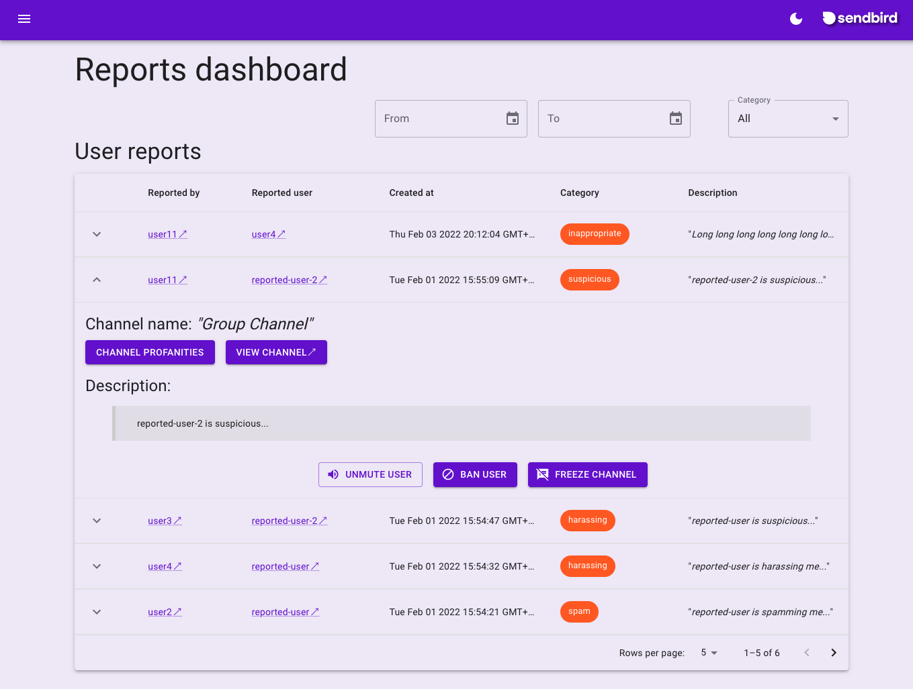
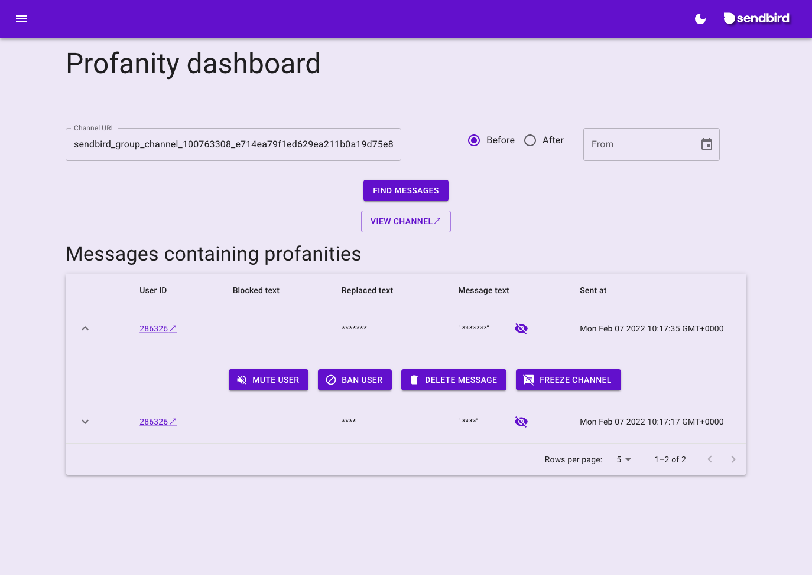

# Sendbird Moderation Dashboard

> This is a sample app that acts as a moderation dashboard for all **reported items, like users, messages and channels**, within a Sendbird Application and any **profanity filtered messages** within channels.

_Built with the **Sendbird Platform API**. For more information about the API and its usage head to the [Report content and subject](https://sendbird.com/docs/chat/v3/platform-api/guides/report-content-and-subject) section of the Sendbird Platorm API Docs._

<h2 style="text-align: center">
  <a href="https://charistheo.github.io/sendbird-moderation-dashboard/">
    Live demo
  </a>
</h2>

<p style="text-align: center">
  
<p>
<p style="text-align: center">
  
<p>

## Features

* List all reported items divided by users, messages and channels
* Filter reported items by date and type (_suspicious_, _harassing_, _inappropriate_, or _spam_)
* View profanity filtered messages in a channel
* Mute / Unmute reported users
* Ban / Unban reported users
* Delete reported messages
* Freeze / Unfreeze channels

## Development

### Download

```sh
git clone https://github.com/charisTheo/sendbird-moderation-dashboard.git
cd sendbird-moderation-dashboard
```

### Install

```sh
npm i
```

### Run

```sh
npm start
```

### Build

```sh
npm run build
```

> The output of the build command above will be under the `./docs` directory of the project root directory.
